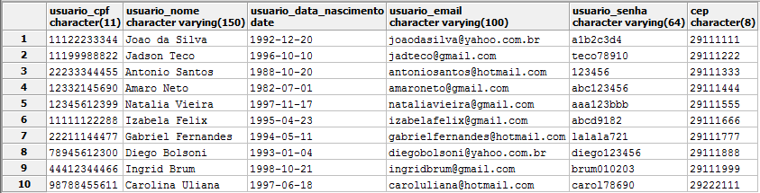

# TRABALHO 01: Smart Pay
Trabalho desenvolvido durante a disciplina de BD1

# Sumário

### 1. COMPONENTES 
Douglas da Silva Sousa: douglass.sousa@outlook.com.br 
Ewerson Vieira Nascimento: ewersonv@gmail.com 
Julio Cesar da Silva Santos: jul10css.c@gmail.com 
Gabriel Borlot Souza Barbosa: gborlotbarbosa@gmail.com 

### 2.INTRODUÇÃO E MOTIVAÇAO 

> A bilhetagem eletrônica já é uma realidade nos transportes públicos do nosso estado a algum tempo, diversas pessoas fazem uso do seu cartão para se movimentar durante o dia-a-dia, seja de uso particular ou vinculado ao trabalho. Podemos dizer que a solução existente dá conta do recado e atende bem o seu propósito, mas somente isso. Ainda temos que enfrentar diversos problemas com o uso do cartão como meio de pagamento, problemas esses que nos custam tempo e dinheiro, como a recarga em que temos que enfrentar uma fila enorme e taxas por perda ou quebra do cartão.

>A partir dessa visão começamos a buscar por alternativas que poderiam atuar como meio de pagamento das passagens, sendo acessível, seguro e fácil de utilizar. A resposta estava na cara, ou melhor, no bolso: nossos smartphones, sem dúvidas, seriam a melhor solução.

>Através de tecnologias presentes nesses dispositivos seria possível efetuar o pagamento da mesma forma que já fazemos, apenas o aproximando do leitor, ou até mesmo com um qrcode gerado e lido por câmeras já presentes nos coletivos, mas que tem como finalidade a identificação de fraudes por comparação facial. Além do já esperado, esse novo método traria os benefícios da internet, facilitando a recarga de nossas passagens através de cartões de credito ou boletos bancários. Como essas funções teriam que ser controlados por meio de um software, ainda poderíamos ter um controle de nossos gastos, com históricos de transações, linhas utilizadas e muito mais.
 

### 3.MINI-MUNDO Novo 

>O sistema proposto conterá as informacões aqui detalhadas. Dos usuários serão armazenados o nome completo, data de nascimento, cpf, endereço, e-mail e senha, sendo esse dois ultimos para efetuar login no sistema. Só poderá existir um unico cadastro para cada CPF. Dos meios de pagamento, serão armazenados dados de cartões de credito salvos, contendo o numero do cartão, nome do titular e data de validade. Os dados armazenados pertinentes ao cartão de credito deverão seguir as regras do PCI Security Standards Council visando a confiabilidade do sistema. Um usuário pode ter mais de um cartão de crédito. O histórico de uso do aplicativo também deve ter seus dados armazenados, que são as linhas usadas, junto com a data, horario e valor debitado da conta. Os dados dos horários de onibus serão obitidos por API, e serão armazendados apenas os favoritos, que devem possuir numero da linha, descrição e os horarios semanais e diarios de origem e destino. O itinerario também será obtido por API, e armazenados apenas os favoritos, com linha, sentido da linha, ponto de origem, pontos de passagem e ponto de destino da linha. O saldo do usuário deve ser sincronizado com a empresa responsável pelo seu uso.

### 4.RASCUNHOS BÁSICOS DA INTERFACE (MOCKUPS) 

<b style="font-size: 20px;">[Mockup do projeto](arquivos/Mockup.pdf)</b>

#### 4.1 QUAIS PERGUNTAS PODEM SER RESPONDIDAS COM O SISTEMA PROPOSTO?
    a) O sistema proposto poderá fornecer quais tipos de relatórios e informaçes? 
    b) Crie uma lista com os 5 principais relatórios que poderão ser obtidos por meio do sistema proposto!
    
* Relatório que informe ao usuário seu histórico de passagens como dia e horários em que usou o sistema.
* Relatório de linhas do sistema de transporte público mais utilizadas e as menos utilizadas dependendo do horário.
* Relatório que informe a gerencia qual a melhor forma de pagamento desejados pelos clientes: boleto bancário, cartão de credito, picpay ou em dinheiro em um posto de atendimento.
* Relatório que informe a gerencia bairros ou pontos de ônibus onde há maior concentração de passageiros que efetuam o embarque e o desembarque dos coletivos.
* Relatório de tempo médio de viagem de cada linha de um terminal rodoviário a outro como também se o trajeto efetuado é o mais efetivo.
* Relatório direcionado ao usuário para controle de suas viagens como quantidade de passagens utilizadas durante o dia/semana/mês e se o valor de recarga utilizado atenderá sua média de demanda.

 
#### 4.2 TABELA DE DADOS DO SISTEMA:
    a) Esta tabela deve conter todos os atributos do sistema e um mínimo de 10 linhas/registros de dados.
    b) Esta tabela tem a intenção de simular um relatório com todos os dados que serão armazenados 
    e deve ser criada antes do modelo conceitual
    c) Após criada esta tabela não deve ser modificada, pois será comparada com os resultados finais na conclusão do trabalho
    
<b style="font-size:20px;"> [Tabelao de dados](arquivos/tabelasSeparadas.ods)</b>  
<b style="font-size:20px;"> [Tabela de dados Normalizada](arquivos/tabelasSeparadasNormalizadas.ods) 
    
>## Marco de Entrega 01 em: (02/04/2018) 

### 5.MODELO CONCEITUAL 
    A) NOTACAO ENTIDADE RELACIONAMENTO 
        * Para nosso prótótipo limitaremos o modelo conceitual nas 6 principais entidades do escopo
        * O protótipo deve possui no mínimo duas relações N para N
        * o mínimo de entidades do modelo conceitual será igual a 5
        

    
    B) NOTACAO UML (Caso esteja fazendo a disciplina de analise)
    C) QUALIDADE 
        Garantir que a semântica dos atributos seja clara no esquema
        Criar o esquema de forma a garantir a redução de informação redundante, possibilidade de valores null, 
        e tuplas falsas
    
        
    
#### 5.1 Validação do Modelo Conceitual
    [Grupo01]: [Nomes dos que participaram na avaliação]
    [Grupo02]: [Nomes dos que participaram na avaliação]

#### 5.2 DECISÕES DE PROJETO
    Trajeto: Criamos uma entidade de relacionamento entre as tabelas Via e Linha para implementar uma função no aplicativo que encontre as linhas que passam por aquela via (ou próximas a ela) e levam o usuário ao destino solicitado.
    Tipo_Horario: Essa tabela foi criada com o intuito de identificar qual o tipo de horario será seguido por aquela linha, dias úteis, feriados,atípicos entre feriados ou fins de semana.
    Cartão: A tabela cartão possui relação (0,n) com usuário, pois decidimos que o usuário pode ou não ter um cartão de crédito para usar o app.
    

>## Marco de Entrega 02 em: (23/04/2018) 
#### 5.3 DESCRIÇÃO DOS DADOS 
    
    LOGRADOURO: Armazena informações sobre o logradouro (CEP, tipo e nome).
    BAIRRO: Armazena informações sobre o bairro (nome e ID).
    HISTÓRICO: Tabela que armazena o histórico de pagamentos em datas e horarios específicos.
    USUÁRIO: Tabela que armazena as informações relacionadas ao usuário do sistema. 
    CIDADE: Armazena informações sobre a cidade (nome e ID).
    CARTÃO: Tabela que contém dados do cartão de passagem do usuário.
    TERMINAL_SEQ: Contém informações sobre o terminal (ID e nome).
    HORÁRIO: Contém dados sobre horarios das linhas
    LINHA: Contém informações sobre a linha do ônibus.
       
    
    
    
### 6	MODELO LÓGICO 
<!---
        a) inclusão do modelo lógico do banco de dados
        b) verificação de correspondencia com o modelo conceitual 
        (não serão aceitos modelos que não estejam em conformidade)
--->

### 7	MODELO FÍSICO 
[Modelo Físico - Intruções](sql/Nddl.sql)
<!---
        a) inclusão das instruções de criacão das estruturas DDL 
        (criação de tabelas, alterações, etc..)      
--->    
        
### 8	INSERT APLICADO NAS TABELAS DO BANCO DE DADOS 
#### 8.1 DETALHAMENTO DAS INFORMAÇÕES
[Arquivo insert](sql/Ninsert.ddl)
<!---
        a) inclusão das instruções de inserção dos dados nas tabelas criadas pelo script de modelo físic
        b) formato .SQL
--->
#### 8.2 INCLUSÃO DO SCRIPT PARA CRIAÇÃO DE TABELA E INSERÇÃO DOS DADOS
[Criacao das estruturas e insercoes](sql/estrutura_insercao.sql)
<!---
        a) Junção dos scripts anteriores em um único script 
        (create para tabelas e estruturas de dados + dados a serem inseridos)
        b) Criar um novo banco de dados para testar a restauracao 
        (em caso de falha na restauração o grupo não pontuará neste quesito)
        c) formato .SQL
--->
#### 8.3 INCLUSÃO DO SCRIPT PARA EXCLUSÃO DE TABELAS EXISTENTES, CRIAÇÃO DE TABELA NOVAS E INSERÇÃO DOS DADOS
[Exclusao das estruturas, criacao e insersao](sql/drop_estrutura_insersao.sql)
<!---
        a) Junção dos scripts anteriores em um único script 
        (Drop table + Create de tabelas e estruturas de dados + dados a serem inseridos)
        b) Criar um novo banco de dados para testar a restauracao 
        (em caso de falha na restauração o grupo não pontuará neste quesito)
        c) formato .SQL
--->
>## Marco de Entrega 03 em: (14/05/2018) 

### 9	TABELAS E PRINCIPAIS CONSULTAS 
    OBS: Incluir para cada tópico as instruções SQL + imagens (print da tela) mostrando os resultados. 
#### 9.1	CONSULTAS DAS TABELAS COM TODOS OS DADOS INSERIDOS (Todas)  
SELECT * FROM linha;
  

SELECT * FROM cidade;
  

SELECT * FROM bairro;
  

SELECT * FROM logradouro;
  

SELECT * FROM usuario;
  

SELECT * FROM cartao;
  

SELECT * FROM via;
  

SELECT * FROM itinerario;
  

SELECT * FROM tipo_horario;
  

SELECT * FROM horario;
  

SELECT * FROM historico;
  

#### 9.2	CONSULTAS DAS TABELAS COM FILTROS WHERE (Mínimo 4) 
#### 9.3	CONSULTAS QUE USAM OPERADORES LÓGICOS, ARITMÉTICOS E TABELAS OU CAMPOS RENOMEADOS (Mínimo 11)
    a) Criar 5 consultas que envolvam os operadores lógicos AND, OR e Not
    b) Criar no mínimo 3 consultas com operadores aritméticos 
    c) Criar no mínimo 3 consultas com operação de renomear nomes de campos ou tabelas
#### 9.4	CONSULTAS QUE USAM OPERADORES LIKE E DATAS (Mínimo 12)  
    a) Criar outras 5 consultas que envolvam like ou ilike
    b) Criar uma consulta para cada tipo de função data apresentada.

>## Marco de Entrega 04 em: (04/06/2017) 
    
#### 9.5	ATUALIZAÇÃO E EXCLUSÃO DE DADOS (Mínimo 6) 
#### 9.6	CONSULTAS COM JUNÇÃO E ORDENAÇÃO (Mínimo 6) 
        a) Uma junção que envolva todas as tabelas possuindo no mínimo 3 registros no resultado
        b) Outras junções que o grupo considere como sendo as de principal importância para o trabalho
#### 9.7	CONSULTAS COM GROUP BY E FUNÇÕES DE AGRUPAMENTO (Mínimo 6) 
#### 9.8	CONSULTAS COM LEFT E RIGHT JOIN (Mínimo 4) 
#### 9.9	CONSULTAS COM SELF JOIN E VIEW (Mínimo 6) 
        a) Uma junção que envolva Self Join
        b) Outras junções com views que o grupo considere como sendo de relevante importância para o trabalho
#### 9.10	SUBCONSULTAS (Mínimo 3) 
### 10	ATUALIZAÇÃO DA DOCUMENTAÇÃO DOS SLIDES PARA APRESENTAÇAO FINAL (Mínimo 6 e Máximo 10) 

### 11 Backup completo do banco de dados postgres 
    a) deve ser realizado no formato "backup" 
        (Em Dump Options #1 Habilitar opções Don't Save Owner e Privilege)
    b) antes de postar o arquivo no git o mesmo deve ser testado/restaurado por outro grupo de alunos/dupla
    c) informar aqui o grupo de alunos/dupla que realizou o teste.

### 12	TUTORIAL COMPLETO DE PASSOS PARA RESTAURACAO DO BANCO E EXECUCAO DE PROCEDIMENTOS ENVOLVIDOS NO TRABALHO PARA OBTENÇÃO DOS RESULTADOS 
        a) Outros grupos deverão ser capazes de restaurar o banco 
        b) executar todas as consultas presentes no trabalho
        c) executar códigos que tenham sido construídos para o trabalho 
        d) realizar qualquer procedimento executado pelo grupo que desenvolveu o trabalho
        
### 13   DIFICULDADES ENCONTRADAS PELO GRUPO 
>## Marco de Entrega Final em: (25/06/2018) 
        
### 14  FORMATACAO NO GIT: https://help.github.com/articles/basic-writing-and-formatting-syntax/
<comentario no git>
    
##### About Formatting
    https://help.github.com/articles/about-writing-and-formatting-on-github/
    
##### Basic Formatting in Git
    
    https://help.github.com/articles/basic-writing-and-formatting-syntax/#referencing-issues-and-pull-requests
    
    
##### Working with advanced formatting
    https://help.github.com/articles/working-with-advanced-formatting/
#### Mastering Markdown
    https://guides.github.com/features/mastering-markdown/

    

    
### OBSERVAÇÕES IMPORTANTES

#### Todos os arquivos que fazem parte do projeto (Imagens, pdfs, arquivos fonte, etc..), devem estar presentes no GIT. Os arquivos do projeto vigente não devem ser armazenados em quaisquer outras plataformas.
1. Caso existam arquivos com conteúdos sigilosos, comunicar o professor que definirá em conjunto com o grupo a melhor forma de armazenamento do arquivo.

#### Todos os grupos deverão fazer Fork deste repositório e dar permissões administrativas ao usuário deste GIT, para acompanhamento do trabalho.

#### Os usuários criados no GIT devem possuir o nome de identificação do aluno (não serão aceitos nomes como Eu123, meuprojeto, pro456, etc). Em caso de dúvida comunicar o professor.

Link para BrModelo: 
http://sis4.com/brModelo/brModelo/download.html
 

Link para curso de GIT 

